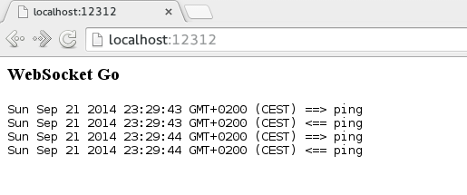

Using websockets in Go is straightforward and simple. We'll use [gin-gonic](http://gin-gonic.github.io/gin/) as our web framework and the [Gorilla web toolkit](http://www.gorillatoolkit.org/) to add websockets to it.

Gin + Gorilla = ...

<span class="more"></span>

## Gin-Gonic

Let's start with a simple server. First, go get Gin:

```bash
go get github.com/gin-gonic/gin
```

Now create your server:

```go
package main

import (
    "github.com/gin-gonic/gin"
)

func main() {

    r := gin.Default()

    r.GET("/", func(c *gin.Context) {
        c.String(200, "We got Gin")
    })

    r.Run("localhost:12312")
}
```

Run it and open your browser on [localhost:12312](http://localhost:12312). You should be greeted with "We got Gin".

## Gorilla

Time to add websockets via Gorilla web toolkit. First run `go get github.com/gorilla/websocket` and import it.

Next, create a websocket handler. Let's have it act as a simple echo server: It will read messages and echo them back.

```go
var wsupgrader = websocket.Upgrader{
    ReadBufferSize:  1024,
    WriteBufferSize: 1024,
}

func wshandler(w http.ResponseWriter, r *http.Request) {
    conn, err := wsupgrader.Upgrade(w, r, nil)
    if err != nil {
        fmt.Println("Failed to set websocket upgrade: %+v", err)
        return
    }

    for {
        t, msg, err := conn.ReadMessage()
        if err != nil {
            break
        }
        conn.WriteMessage(t, msg)
    }
}
```

As you can see in the `wshandler` function, the `for`-loop will run until the connection ends and write back whatever the client sends. Once an error is encoutered or the connection breaks, the loop is finished and the handler ends.

Finally we add it to our Gin context:

```go
r.GET("/ws", func(c *gin.Context) {
    wshandler(c.Writer, c.Request)
})
```

Let's see it in action.

## Client

We will create a small html file which communicates with our websocket server. This client sends and receives a message via javascript every second and displays it on the site.

```html
<html>
  <head>
    <script src="https://code.jquery.com/jquery-2.1.1.min.js"></script>
  </head>

  <body>
    <h3>WebSocket Go</h3>
    <pre id="output"></pre>

    <script>
      url = 'ws://localhost:12312/ws';
      c = new WebSocket(url);
      
      send = function(data){
        $("#output").append((new Date())+ " ==> "+data+"\n")
        c.send(data)
      }

      c.onmessage = function(msg){
        $("#output").append((new Date())+ " <== "+msg.data+"\n")
        console.log(msg)
      }

      c.onopen = function(){
        setInterval( 
          function(){ send("ping") }
        , 1000 )
      }
    </script>

  </body>
</html>
```

Let's include this file in our go server:

```go
r.LoadHTMLFiles("index.html")

r.GET("/", func(c *gin.Context) {
    c.HTML(200, "index.html", nil)
})
```

The complete go code should now look like this:

```go
package main

import (
    "fmt"
    "github.com/gin-gonic/gin"
    "github.com/gorilla/websocket"
    "net/http"
)

func main() {

    r := gin.Default()
    r.LoadHTMLFiles("index.html")

    r.GET("/", func(c *gin.Context) {
        c.HTML(200, "index.html", nil)
    })

    r.GET("/ws", func(c *gin.Context) {
        wshandler(c.Writer, c.Request)
    })

    r.Run("localhost:12312")
}

var wsupgrader = websocket.Upgrader{
    ReadBufferSize:  1024,
    WriteBufferSize: 1024,
}

func wshandler(w http.ResponseWriter, r *http.Request) {
    conn, err := wsupgrader.Upgrade(w, r, nil)
    if err != nil {
        fmt.Println("Failed to set websocket upgrade: %+v", err)
        return
    }

    for {
        t, msg, err := conn.ReadMessage()
        if err != nil {
            break
        }
        conn.WriteMessage(t, msg)
    }
}
```

Run it and point your browser to [localhost:12312](http://localhost:12312). You should now see the ping messages and responses:



Happy hacking. No animals were harmed in making this blog.