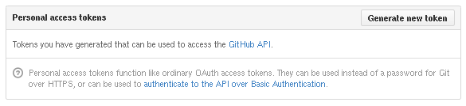
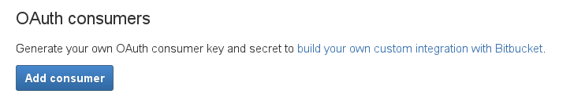

Most people don't worry about this. But when it comes to safety and compliance, or even the occasional force-push or delete, you will be happy to still have a working backup of your repository. This is how to do it easily.

<span class="more"></span>

In order to get all your repositories, you are faced with two challenges: (1) get a list of repos and (2) actually download or update everything.

## Go get my git

Let's start with the latter: Getting all your git.

My first thought was something along these lines:

```bash
test ! -d repo && git clone https://github.com/user/repo.git
cd repo
git fetch --all --prune
git pull
```

It's simple to start, but will quickly open questions like: What folder structure to keep? Will these git commands work in every situation? And finally: Shouldn't I create a wrapper for this in &lt;insert favorite scripting language&gt;?

A great solution to all these questions is to use a project like [ghq](https://github.com/motemen/ghq) instead.

```bash
ghq get -u -p https://github.com/user/repo.git
```

Which will create a folder structure with your repo:

```
.
└── github.com
    └── user
        └── repo
            ├── ...
            ...
```

The destination folder for your backup can be configured this way:

```bash
git config --global ghq.root <DESTINATION>
ghq get -u -p https://github.com/user/repo.git
```

This is especially important if you plan to use ghq for other purposes and change the destination. Otherwise just rely on your git-configured `ghq.root`.

A great improvement for backups is to remove your local workspace. To restore your data and any future work with the repository you only need the `.git` folder. Local files can quickly be removed with:

```bash
rm -rf github.com/*/*/*
```

This command will leave all your "hidden" files intact, i.e. it won't remove the `.git` folder. When you want to restore your workspace, it's as simple as:

```bash
cd github.com/user/repo
git reset --hard HEAD
```

This practice may easily cut your total size in half. 

From here you can continue with whatever method you like: Keep your repos on a backup node, copy them to FTP or even opt for a nice S3 backup (see [this guide](http://lollyrock.com/articles/s3cmd-with-radosgw/))

## Find my repos

When you want to automate this for multiple repositories, you could always opt for a fixed list with all needed entries inside (example in ruby):

```ruby
repos = %w{
  https://github.com/user/repo1.git
  https://github.com/user/repo2.git
  ...
}
```

It's alright if you don't have too many repositories or don't mind the overhead of managing this list.

A more advanced solution, however, is to back up all repositories of a user or group. This approach depends on whichever provider you use for serving your git, i.e. Github, Bitbucket, Gitlab, or friends. All of them have different APIs for querying users and their repositories.

Let's show two examples written in Ruby, one for Github and one Bitbucket.

### Github

1. Get the `octokit` gem
     
    ```bash   
    gem install octokit
    ```

2. Configure an access token in your Github profile.

    At the time of writing: Go to your User Settings, "Applications", under "Personal access tokens" click on "Generate new token". This token will be used in the next step.

    

3. Get all repositories for ghq

    ```ruby
    require 'octokit'
    github = Octokit::Client.new access_token: "..."

    # list all repositories of a user/group
    repos = github.repositories(user="...")

    # get a list of clone urls for ghq
    urls = repos.map{|x| x[:clone_url] }
    ```

### Bitbucket

1. Get the `bitbucket_rest_api` gem

    ```bash
    gem install bitbucket_rest_api
    ```

2. Configure an OAuth consumer.

    At the time of writing: Go to "Manage Account", "OAuth", and "Add consumer". Each consumer comes with a key and secret which you need in the next step.

    

3. Get all repositories for ghq

    ```ruby
    require 'bitbucket_rest_api'
    bitbucket = BitBucket.new client_id: "<key>", client_secret: "<secret>"

    # list all repositories of a user/group
    repos = bitbucket.repos.list

    # get a list of clone urls for ghq
    repos.map{|x| "git@bitbucket.org:#{x['owner']}/#{x['slug']}" }
    ```


## Final thoughts

It's quick and simple to create a full backup of all repositories as this article has shown. The next step is to attach it to your backup system and get it running regularly. We have also opted for an encryption layer on top for data privacy which is highly recommended for all data that is not open source.

Enjoy!