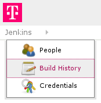

<a href="https://github.com/arlimus/jenkins-style"></a>

Jenkins has a nice theming plugin available. To use it you need to set up a stylesheet that is accessible to everyone user. I created a few themes found [here](https://github.com/arlimus/jenkins-style).

<span class="more"></span>

The themes are found on github and hosted via github pages. They can easily be used in jenkins by copying the css of the theme you like into the configuration of the Simple Theme Plugin for Jenkins.

I have create a theme for my company's Jenkins:



Link to the css:

```
http://arlimus.github.io/jenkins-style/telekom.css
```

The source is written in SASS and can be found [here](https://github.com/arlimus/jenkins-style/blob/master/css/telekom.scss).